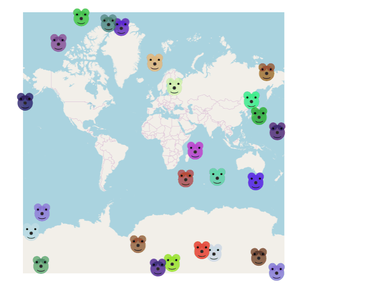

# Custom Style Renderers

## Summary

As of 2.0.0-beta.37 Mapsui supports *custom style renderers*. This means a user can create a *custom style* and associate this with a *custom style renderer* to allow full freedom in rendering a feature the way the user would like.

## How it works
- Create a custom style by deriving a class from IStyle. 
- Assign that style to an ILayer.Style or IFeature.Styles.
- Create a custom renderer by deriving a class from ISkiaStyleRenderer and implement the Draw method.
- Register the association of the *custom style* to the *custom style renderer* as in the line below. The consequence will be that if the Mapsui renderer detects this style it will call the Draw method on the style renderer. 


This is how you register the association of a custom style to a custom style renderer
```csharp
mapControl.Renderer.StyleRenderers.Add(typeof(CustomStyle), new SkiaCustomStyleRenderer());
```

This is the ISkiaStyleRenderer interface:
```csharp
public interface ISkiaStyleRenderer : IStyleRenderer
{
  bool Draw(SKCanvas canvas, IReadOnlyViewport viewport, ILayer layer, IFeature feature, IStyle style, ISymbolCache symbolCache);
}
```

The IFeature has a Geometry field. The renderer is responsible to cast the IFeature.Geometry to the type it intends to render. The IStyle is the custom style the user defined. It could contain extra style information not present in the default style classes. The user will need to cast that IStyle to the custom style to use this extra information.

## Code sample
Look in the Mapsui source code for CustomStyleSample.cs. 



[This](https://github.com/Mapsui/Mapsui/blob/42b59e9dad1fd9512f0114f8c8a3fd3f5666d330/Samples/Mapsui.Samples.Common/Maps/CustomStyleSample.cs#L16-L51) is the most relevant code. In this sample the custom style contains no extra information, it is just an indication to use the associated custom renderer. It would be possible to add extra field like EarColor and NoseSize to the custom style which could be used in the renderer.

## Remarks
Note, that the renderer depends on the technology we use for the rendering implementation, in this case SkiaSharp. Currently we still support XAML as renderer but this may be removed in the future. We expect to support SkiaSharp for a long time but it may be replaced at some point. There are no such plans just yet.
